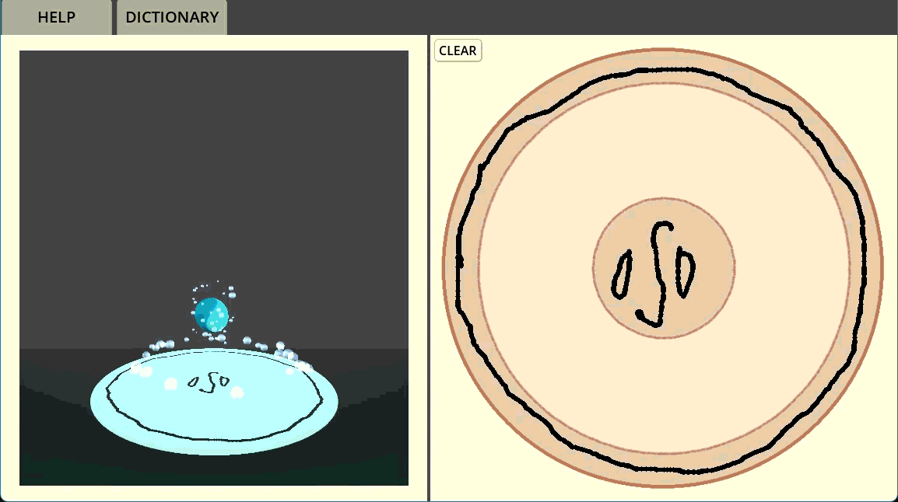

# AtelierMagic
A game simulator for the "Witch Hat Atelier" magic system.

# Installation
The entire simulation is self contained. All needed is to install the zip file and run the program
*Currently available only for windows*

# Versions
## v0.1
Initial Release. Basic Elemental Glyphs and Keystone Spells. A simple but exhaustive pattern-matching for spell classification.

# Reference
Ofcourse, the anime *Witch Hat Atelier*

[Witch Hat Atelier Fandom](https://witch-hat-atelier.fandom.com/wiki/Magic)
[Nerva dof's implementation of the magic system](www.youtube.com/@nervadof), definitely check out his channel!
